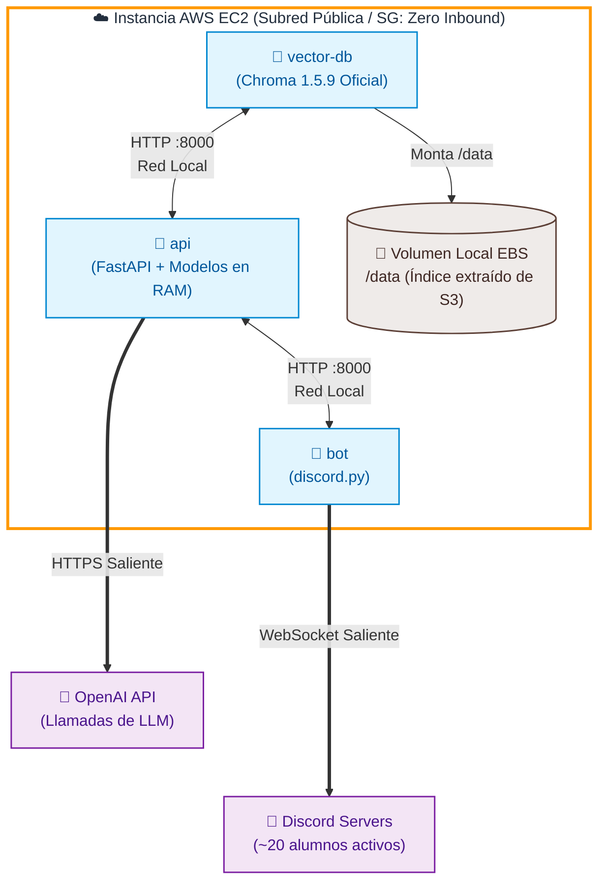
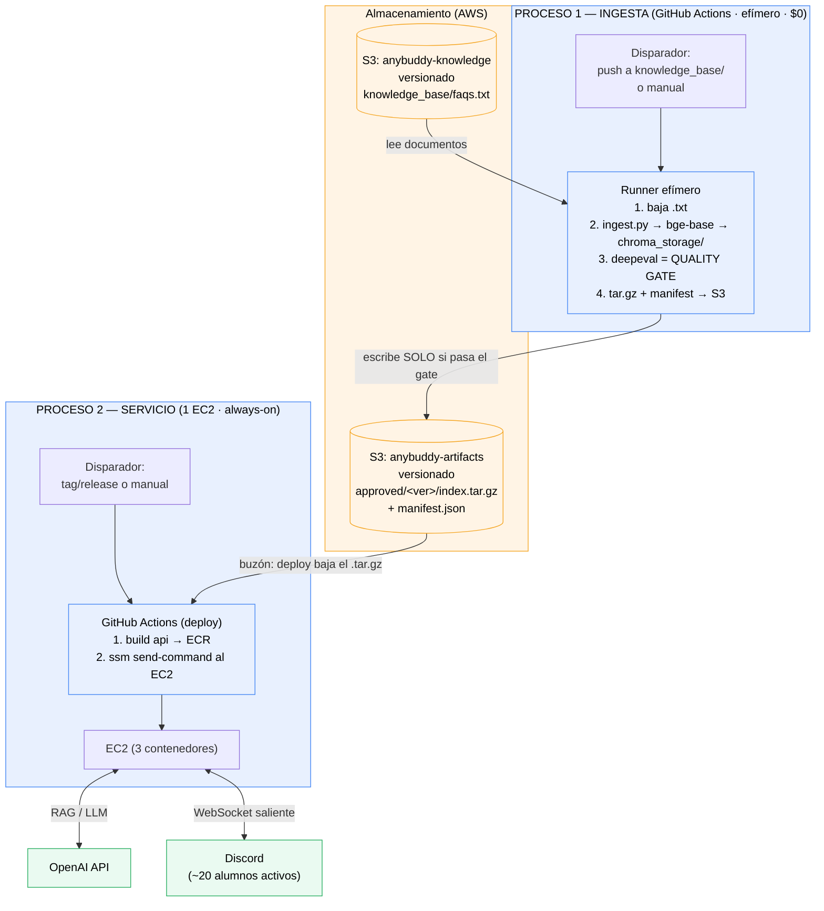
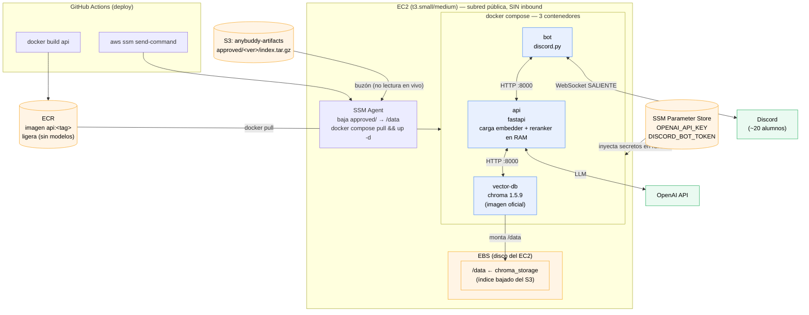
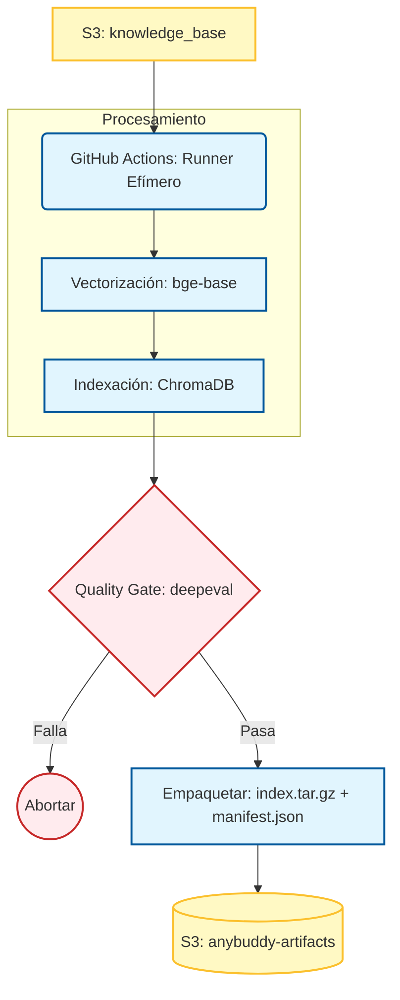

# Arquitectura — AnyBuddy Assistant

Sistema backend de un bot de Discord que asiste a una comunidad de ~50 alumnos
(~20 activos) con preguntas académicas, vía RAG.

El sistema se divide en **dos procesos** que corren en momentos y lugares distintos:

1. **Ingesta** — batch que vectoriza los documentos y publica el índice. Corre en **GitHub Actions** (cómputo $0).
2. **Servicio** — los 3 contenedores que atienden a los usuarios. Corre en **un solo EC2**.

- El handoff entre ambos es **S3** (buzón de artefactos versionado)
- El deploy del
servicio es **condicional** a que la ingesta haya pasado el quality gate de `deepeval`.

---

## 1. Vista general (ambos procesos)

---

## 2. Proceso 1 — Ingesta (detalle)

Corre en un runner efímero de GitHub Actions.

### flujo 
    * El conocimiento fuente vive en un bucket de S3.
    * Cuando se agrega o modifica un documento, S3 genera un evento ObjectCreated.
    * Una AWS Lambda recibe ese evento y envía un repository_dispatch a GitHub con información del archivo afectado.
    * GitHub Actions ejecuta el pipeline de ingestión, chunking, generación de embeddings e indexación, idealmente solo para el documento que cambió.

Flujo completo

Usuario sube o modifica un documento en S3
                    ↓
           Evento ObjectCreated
                    ↓
                AWS Lambda
                    ↓
          repository_dispatch
                    ↓
       GitHub Actions (Workflow 1)
Ingestión → Chunking → Embeddings → Indexación

---

## 3. Proceso 2 — Servicio (detalle del EC2)

**1 EC2** en subred pública, Security Group **sin inbound**, administrado por **SSM**
(sin SSH, sin puerto 22). Dentro corren **3 contenedores** vía `docker compose`.

---

## 4. Quién vive dónde

| Componente | Dónde vive | Cómo se comunica |
|---|---|---|
| **Ingesta** (`ingest.py` + deepeval) | GitHub Actions (efímero) | lee S3-knowledge, escribe S3-artifacts |
| **Índice vectorial** (`chroma_storage`) | nace en CI → **S3** → se copia al **EBS** del EC2 | Chroma lo monta como `/data` |
| **Documentos** (`faqs.txt`) | **S3-knowledge** (versionado) | CI lo baja en cada ingesta |
| **Los 2 modelos** (embedder + reranker) | **S3** → cache en volumen del EC2 (bajados al arrancar, vía `model_loader`) | se cargan en RAM al arrancar la API |
| **vector-db** (Chroma 1.5.9) | contenedor en el **EC2** | HTTP con la API (red local) |
| **api** (FastAPI) | contenedor en el **EC2** | HTTP con Chroma y con el bot; llama a OpenAI |
| **bot** (discord.py) | contenedor en el **EC2** | HTTP a la API; WebSocket **saliente** a Discord |
| **Secretos** | **SSM Parameter Store** | inyectados al EC2 en runtime |

---

## 5. Las 3 ideas clave

1. **Gate condicional:** el deploy solo es posible porque existe algo en `approved/`, y a
   `approved/` solo se llega si **deepeval pasó**. Ahí se materializa que el "proceso 2
   depende del proceso 1".
2. **S3 es buzón, no fuente viva:** Chroma lee de `/data` (EBS), nunca de S3 directo.
   S3 solo entrega el `.tar.gz`.
3. **EC2 sin puertas abiertas:** ningún inbound. El bot sale solo hacia Discord; la
   administración entra por SSM. Sin NGINX, sin Load Balancer, sin NAT Gateway.

---

## 6. Contrato de compatibilidad (crítico)

Ingesta y servicio **deben** usar versiones idénticas, o el índice no se podrá leer:

- `chromadb` **pineado** a `1.5.x` (igual que el server `chromadb/chroma:1.5.9`).
- Mismo modelo de embedding: `BAAI/bge-base-en-v1.5`.

El `manifest.json` que viaja junto al `.tar.gz` registra `{embedding_model,
chromadb_version, git_sha}` para que el servicio **valide en el arranque** que coincide
con lo que él corre, y falle rápido si no.

---

## 7. Costo estimado

| Recurso | Costo aprox. |
|---|---|
| 1 × EC2 t3.small (always-on) | ~$15/mes (t3.medium ~$30 si la RAM lo exige) |
| Ingesta en GitHub Actions | $0 (free tier / repos privados) |
| S3 + ECR | centavos |
| deepeval (gpt-4o-mini por corrida) | fracciones de centavo |
| NAT Gateway | **$0** (se evita: subred pública egress-only) |

**Total realista: ~$15–30/mes** para todo el sistema sirviendo a ~20 usuarios activos.

---

