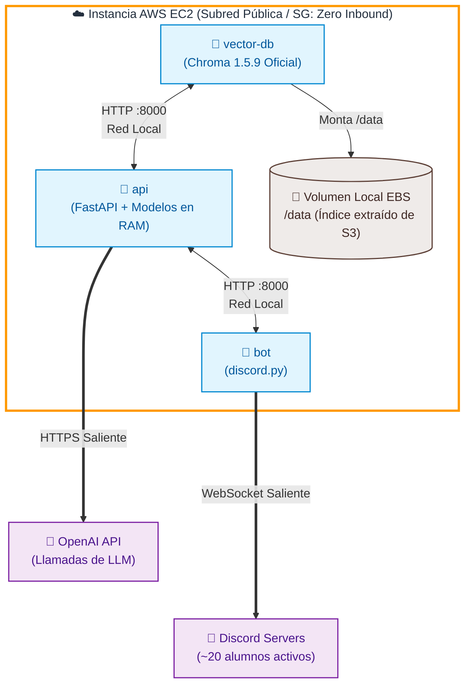
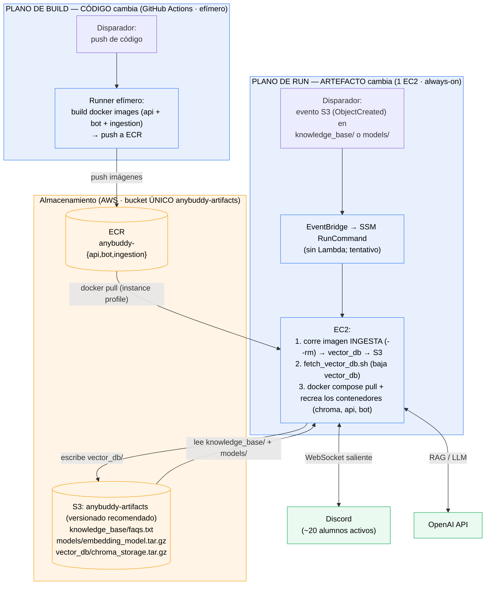
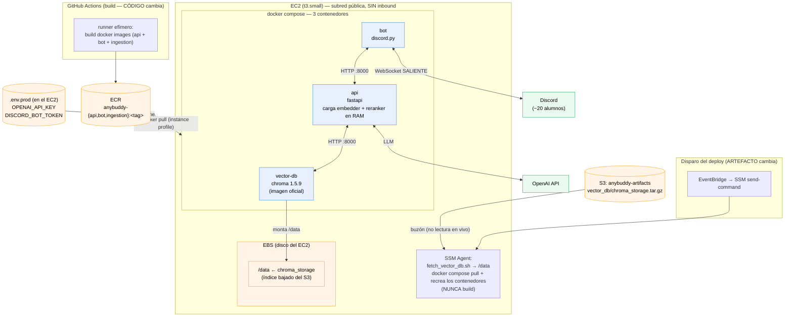
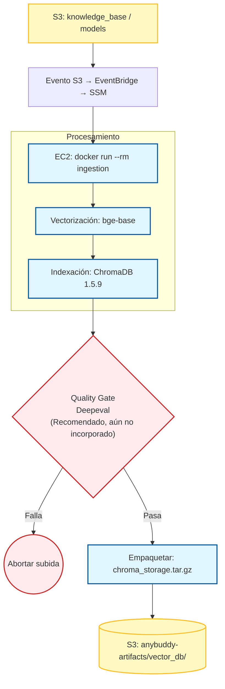

# Arquitectura — AnyBuddy Assistant



Sistema backend de un bot de Discord que asiste a una comunidad de ~50 alumnos
(~20 activos) con preguntas académicas, vía RAG.

El sistema se divide en **dos procesos** que corren en momentos distintos, pero
**en la misma máquina** (un solo EC2):

1. **Ingesta** — batch efímero que vectoriza los documentos y publica el índice.
   Corre como contenedor *one-shot* (`docker run --rm`) **en el EC2**, disparado
   por un cambio de artefacto en S3.
2. **Servicio** — los 3 contenedores permanentes que atienden a los usuarios
   (`restart: unless-stopped`). Corren en **el mismo EC2**.

- El handoff entre ambos es **S3** (buzón de artefactos, versionado recomendado).
- La regla mental que gobierna todo: **código = build; artefacto = run.**
  Cambiar *código* dispara un **build de imágenes Docker** (GitHub Actions → ECR); cambiar
  un *artefacto* (dato/modelo en S3) dispara un **run** de la imagen ya construida
  (evento S3 → EC2). Al cambiar un artefacto **no se compila nada**.

---

## 1. Vista general (ambos procesos)



---

## 2. Proceso 1 — Ingesta (detalle)

Corre como **contenedor efímero en el EC2** (`docker run --rm` de la imagen
`anybuddy-ingestion` bajada de ECR). **No** corre en GitHub Actions: bajo el
modelo "código = build; artefacto = run", GitHub Actions solo construye
imágenes; la ingesta es un *run* de artefacto y sucede en el EC2.

### flujo

* El conocimiento fuente y el modelo de embedding viven en el bucket único
    anybuddy-artifacts (prefijos knowledge_base/ y models/).
* Cuando se agrega o modifica un artefacto, S3 genera un evento ObjectCreated.
* EventBridge (filtrado a los prefijos knowledge_base/ y models/) reacciona
    y ejecuta un SSM RunCommand contra el EC2. (Se descartó Lambda salvo que se
    necesite lógica condicional; decisión tentativa: sin Lambda.)
* El EC2 corre la imagen de ingesta one-shot: chunking, embeddings e
    indexación con Chroma, y sube el índice comprimido a S3 (vector_db/).

Flujo completo

```
[S3: knowledge_base/ o models/] -(evento ObjectCreated)-> [EventBridge (filtro por prefijo)] -(RunCommand)-> [SSM] -(envía comando)-> [EC2] -(docker run --rm anybuddy-ingestion: chunking, embeddings, indexación Chroma)-> [vector_db: chroma_storage.tar.gz] -(subir)-> [S3: vector_db/] -(fetch + recrea)-> [Contenedores: chroma, api, bot]
```

> **Nota — Quality gate (deepeval): recomendado, aún NO incorporado.**
> El plan contempla un gate de calidad con `deepeval` que valide el índice
> **antes** de subirlo a S3 (y aborte la subida si no pasa). La dependencia ya
> está declarada, pero **el gate todavía no está implementado** en el pipeline.
> Es **recomendable pero no mandatorio**: sin él, la ingesta sube el índice sin
> validación de calidad automática.

---

## 3. Proceso 2 — Servicio (detalle del EC2)

**1 EC2** en subred pública, Security Group **sin inbound**, administrado por **SSM**
(sin SSH, sin puerto 22). Autentica contra ECR y S3 con su **instance profile**
(IAM, **cero access keys** en la máquina). Dentro corren **3 contenedores** vía
`docker compose` (con `docker-compose.prod.yml`, que usa `image:` de ECR en vez
de `build:`).



---

## 4. Quién vive dónde

| Componente | Dónde vive | Cómo se comunica |
|---|---|---|
| **Ingesta** (`ingest.py`) | contenedor efímero (`--rm`) **en el EC2** | lee `knowledge_base/` + `models/` de S3, escribe `vector_db/` en S3 |
| **Índice vectorial** (`chroma_storage`) | nace en la ingesta → **S3** → se copia al **EBS** del EC2 | Chroma lo monta como `/data` |
| **Documentos** (`faqs.txt`) | **S3** `anybuddy-artifacts/knowledge_base/` (versionado recomendado) | la ingesta lo baja en cada corrida |
| **Modelo de embedding** | **S3** `models/embedding_model.tar.gz` → cache en el EBS del EC2 (vía `model_loader`) | se carga en RAM al arrancar la API |
| **vector-db** (Chroma 1.5.9) | contenedor en el **EC2** | HTTP con la API (red local) |
| **api** (FastAPI) | contenedor en el **EC2** | HTTP con Chroma y con el bot; llama a OpenAI |
| **bot** (discord.py) | contenedor en el **EC2** | HTTP a la API; WebSocket **saliente** a Discord |
| **Imágenes** (api/bot/ingestion) | **ECR** `anybuddy-{api,bot,ingestion}` | el EC2 hace `pull` con su instance profile |
| **Secretos** | **`.env.prod`** en el EC2 | inyectados a los contenedores en runtime |

---

## 5. Las 3 ideas clave

1. **Código = build; artefacto = run.** Cambiar código dispara un *build* de
   imágenes en GitHub Actions (→ ECR); cambiar un artefacto en S3 dispara un *run*
   de la imagen ya construida (evento S3 → EventBridge → SSM → EC2). El EC2 **nunca
   ve el código fuente**: solo baja imágenes ya hechas de ECR.
2. **S3 es buzón, no fuente viva:** Chroma lee de `/data` (EBS), nunca de S3 directo.
   S3 solo entrega el `.tar.gz` (`vector_db/chroma_storage.tar.gz`).
3. **EC2 sin puertas abiertas:** ningún inbound. El bot sale solo hacia Discord; la
   administración entra por SSM; autentica contra ECR/S3 con instance profile. Sin
   NGINX, sin Load Balancer, sin NAT Gateway, sin SSH.

---

## 6. Contrato de compatibilidad (crítico)

Ingesta y servicio **deben** usar versiones idénticas, o el índice no se podrá leer:

- `chromadb` **pineado** a `1.5.9` en ambos lados (igual que el server
  `chromadb/chroma:1.5.9`). **Esto ya está en vigor** (ambos `requirements.txt`).
- Mismo modelo de embedding: `BAAI/bge-base-en-v1.5`.

> **Recomendado, aún NO incorporado — validación por `manifest.json`.**
> El plan es que un `manifest.json` viaje junto al `.tar.gz` registrando
> `{embedding_model, chromadb_version, git_sha}`, y que el servicio **valide en el
> arranque** que coincide con lo que él corre (y falle rápido si no). Hoy **ni el
> `manifest.json` ni la validación en arranque están implementados**: la garantía
> de compatibilidad descansa únicamente en el pin manual de versiones de arriba.
> Es **recomendable pero no mandatorio**.

---

## 7. Costo estimado

| Recurso | Costo aprox. |
|---|---|
| 1 × EC2 t3.small (always-on) | ~$15/mes (t3.medium ~$30 si la RAM lo exige) |
| Ingesta (contenedor `--rm` en el mismo EC2) | $0 extra (reusa la caja que ya existe) |
| Build en GitHub Actions | $0 (free tier) |
| S3 + ECR | centavos |
| NAT Gateway | **$0** (se evita: subred pública egress-only) |

**Total realista: ~$15–30/mes** para todo el sistema sirviendo a ~20 usuarios activos.

---


