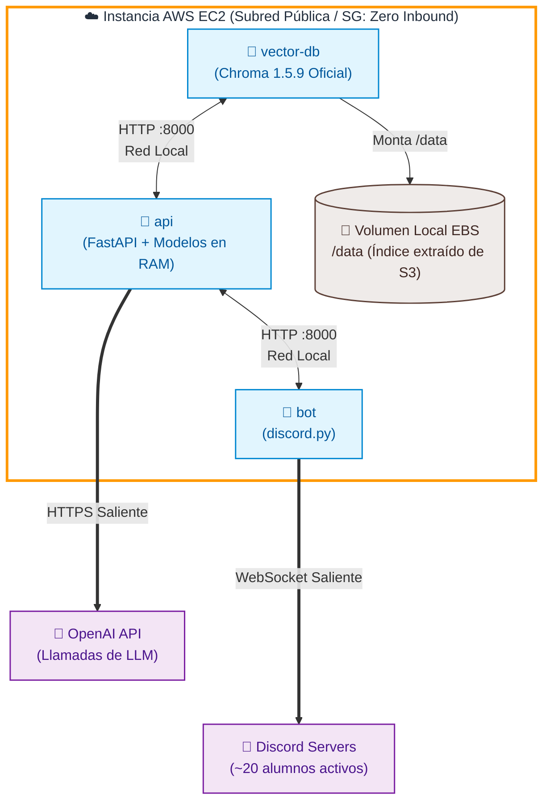
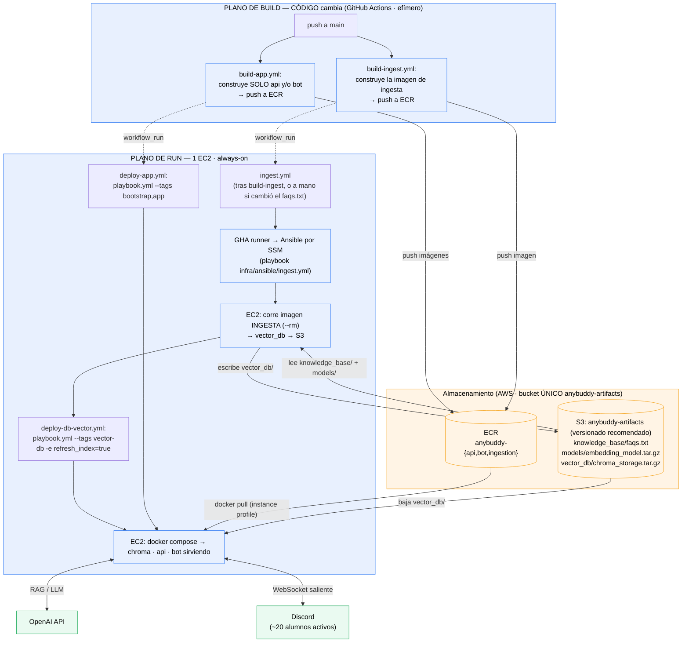
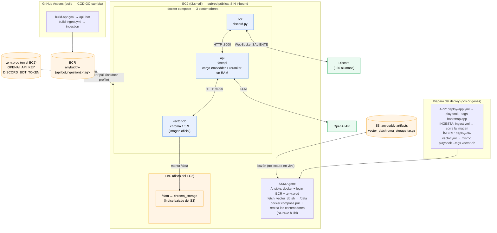
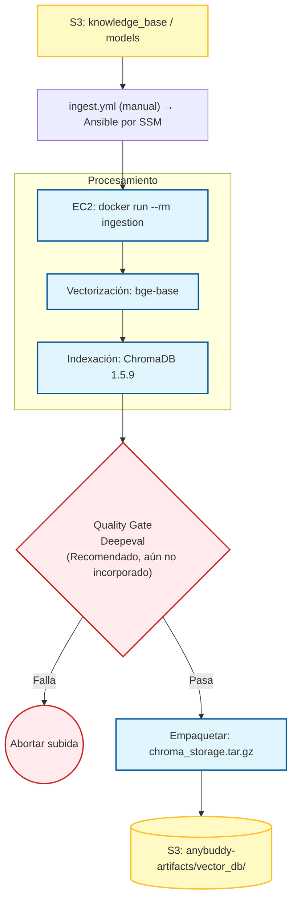

# Arquitectura — AnyBuddy Assistant


```mermaid
graph TD
    %% Definición de Estilos y Clases
    classDef awsNode fill:#f9f9f9,stroke:#FF9900,stroke-width:2px,color:#333;
    classDef container fill:#e1f5fe,stroke:#0288d1,stroke-width:1.5px,color:#01579b;
    classDef storage fill:#efebe9,stroke:#5d4037,stroke-width:1.5px,color:#3e2723;
    classDef external fill:#f3e5f5,stroke:#7b1fa2,stroke-width:1.5px,color:#4a148c;

    %% Bloque Principal: Instancia EC2
    subgraph EC2 ["☁️ Instancia AWS EC2 (Subred Pública / SG: Zero Inbound)"]

        %% Contenedores
        VDB["🐳 vector-db<br>(Chroma 1.5.9 Oficial)"]:::container
        API["🐳 api<br>(FastAPI + Modelos en RAM)"]:::container
        BOT["🐳 bot<br>(discord.py)"]:::container

        %% Almacenamiento Local
        EBS[("💾 Volumen Local EBS<br>/data (Índice extraído de S3)")]:::storage

        %% Interconexiones internas
        VDB <-->|HTTP :8000<br>Red Local| API
        API <-->|HTTP :8000<br>Red Local| BOT
        VDB -->|Monta /data| EBS
    end

    %% Entidades Externas
    OPENAI["🧠 OpenAI API<br>(Llamadas de LLM)"]:::external
    DISCORD["💬 Discord Servers<br>(~20 alumnos activos)"]:::external

    %% Conexiones Salientes (Egress)
    API ====>|HTTPS Saliente| OPENAI
    BOT ====>|WebSocket Saliente| DISCORD

    %% Aplicar estilo a la EC2
    style EC2 fill:#ffffff,stroke:#FF9900,stroke-width:3px,color:#232F3E;
```

Sistema backend de un bot de Discord que asiste a una comunidad de ~50 alumnos
(~20 activos) con preguntas académicas, vía RAG.

El sistema se divide en **dos procesos** que corren en momentos distintos, pero
**en la misma máquina** (un solo EC2):

1. **Ingesta** — batch efímero que vectoriza los documentos y publica el índice.
   Corre como contenedor *one-shot* (`docker run --rm`) **en el EC2**, disparado
   por el workflow `ingest.yml`.
2. **Servicio** — los 3 contenedores permanentes que atienden a los usuarios
   (`restart: unless-stopped`). Corren en **el mismo EC2**.

- El handoff entre ambos es **S3** (buzón de artefactos, versionado recomendado).
- La regla mental que gobierna todo: **api y bot son estado; la ingesta es un evento.**
  api y bot son servicios permanentes: desplegarlos es dejarlos *corriendo con la imagen
  nueva*, y a ese estado `docker compose up -d` llega solo. La ingesta arranca, trabaja y
  muere: no hay contenedor que corregir, así que **una imagen nueva no ejecuta nada**. Hay
  que correrla para que produzca el `vector_db`.
- De ahí la asimetría del pipeline: el plano de la app tiene **build → deploy**, y el plano
  del artefacto tiene **build → run → deploy**, con un paso en el medio que ningún
  `up -d` puede deducir.

> **Cómo se mapea con el pipeline.** Este documento describe los dos **procesos**; el
> [`README.md`](README.md) los opera con **cinco workflows**. La equivalencia:
>
> | Este doc | Workflow | Qué produce |
> |---|---|---|
> | Build de api y bot | `build-app.yml` | imágenes en ECR |
> | Servicio (§3) | `deploy-app.yml` | api y bot en la versión nueva |
> | Build de la ingesta | `build-ingest.yml` | imagen en ECR — **no ejecuta nada** |
> | Ingesta (§2) | `ingest.yml` | índice en S3 `vector_db/` |
> | `fetch` + recreate (§3) | `deploy-db-vector.yml` | Chroma con el índice nuevo |
>
> O sea: la **ingesta es el "build" del plano de artefactos** (entrada cruda → artefacto
> compilado) y S3 `vector_db/` es su registro, igual que ECR lo es para las imágenes.

---

## 1. Vista general (ambos procesos)


```mermaid
flowchart TB
    subgraph BUILD_PLANE["PLANO DE BUILD — CÓDIGO cambia (GitHub Actions · efímero)"]
        direction TB
        TRG0["push a main"]
        GHA["build-app.yml:<br/>construye SOLO api y/o bot<br/>→ push a ECR"]
        GHB["build-ingest.yml:<br/>construye la imagen de ingesta<br/>→ push a ECR"]
        TRG0 --> GHA
        TRG0 --> GHB
    end

    subgraph AWS_STORAGE["Almacenamiento (AWS · bucket ÚNICO anybuddy-artifacts)"]
        direction TB
        ECR[("ECR<br/>anybuddy-{api,bot,ingestion}")]
        S3[("S3: anybuddy-artifacts (versionado recomendado)<br/>knowledge_base/faqs.txt<br/>models/embedding_model.tar.gz<br/>vector_db/chroma_storage.tar.gz")]
    end

    subgraph RUN_PLANE["PLANO DE RUN — 1 EC2 · always-on"]
        direction TB
        TRG1["ingest.yml<br/>(tras build-ingest, o a mano si cambió el faqs.txt)"]
        EVT["GHA runner → Ansible por SSM<br/>(playbook infra/ansible/ingest.yml)"]
        EC2["EC2: corre imagen INGESTA (--rm)<br/>→ vector_db → S3"]
        TRG2["deploy-db-vector.yml:<br/>playbook.yml --tags vector-db -e refresh_index=true"]
        TRG3["deploy-app.yml:<br/>playbook.yml --tags bootstrap,app"]
        EC2B["EC2: docker compose → chroma · api · bot sirviendo"]
        TRG1 --> EVT --> EC2 --> TRG2 --> EC2B
        TRG3 --> EC2B
    end

    EXT["Discord<br/>(~20 alumnos activos)"]
    OAI["OpenAI API"]

    GHA -- "push imágenes" --> ECR
    GHB -- "push imagen" --> ECR
    GHA -. "workflow_run" .-> TRG3
    GHB -. "workflow_run" .-> TRG1
    ECR -- "docker pull (instance profile)" --> EC2B
    S3 -- "lee knowledge_base/ + models/" --> EC2
    EC2 -- "escribe vector_db/" --> S3
    S3 -- "baja vector_db/" --> EC2B
    EC2B <-- "RAG / LLM" --> OAI
    EC2B <-- "WebSocket saliente" --> EXT

    classDef ci fill:#e8f0fe,stroke:#4285f4,color:#000
    classDef store fill:#fff4e5,stroke:#f5a623,color:#000
    classDef ext fill:#eafaf1,stroke:#27ae60,color:#000
    class BUILD_PLANE,GHA,GHB ci
    class RUN_PLANE,EVT,EC2,EC2B ci
    class ECR,S3,AWS_STORAGE store
    class EXT,OAI ext
```

---

## 2. Proceso 1 — Ingesta (detalle)

Corre como **contenedor efímero en el EC2** (`docker run --rm` de la imagen
`anybuddy-ingestion` bajada de ECR). **No** corre en GitHub Actions: el runner
solo construye imágenes y da la orden; el trabajo pesado —modelo de embeddings
en RAM, vectorización de 15-20 min— sucede en el EC2.

### flujo

* El conocimiento fuente y el modelo de embedding viven en el bucket único
    anybuddy-artifacts (prefijos knowledge_base/ y models/).
* El disparador es **mixto**, el workflow `ingest.yml`:
    **automático** cuando `build-ingest.yml` publica una imagen nueva (cambió el código de
    la ingesta), y **manual** (`workflow_dispatch`) cuando cambió el `faqs.txt`.
* El runner de GHA no hace el trabajo, solo lo ordena: entra por SSM con Ansible
    y lanza el contenedor en el EC2.
* El EC2 corre la imagen de ingesta one-shot: chunking, embeddings e
    indexación con Chroma, y sube el índice comprimido a S3 (vector_db/).
* Al terminar encadena `deploy-db-vector.yml`, que corre `playbook.yml --tags vector-db`
    con `refresh_index=true`: baja el índice y recrea **solo** el contenedor `vector-db`.

Flujo completo

```
[build-ingest.yml, o Run workflow a mano] -> [ingest.yml: GHA runner] -(Ansible por SSM)-> [EC2] -(docker run --rm anybuddy-ingestion: chunking, embeddings, indexación Chroma)-> [vector_db: chroma_storage.tar.gz] -(subir)-> [S3: vector_db/] -(deploy-db-vector.yml)-> [vector-db recreado]
```

> **Por qué el disparo es mixto.** Son dos situaciones distintas. Cuando cambia el
> **código**, el sistema ya sabe que cambió: el push lo disparó, `build-ingest.yml` lo
> construyó, y encadenar sale gratis. Sin eso, la imagen nueva se queda en ECR sin
> ejecutarse y el bot sigue respondiendo con un índice que produjo el código viejo.
> Cuando cambia el **`faqs.txt`**, el que se entera es una persona que va a entrar igual a
> subir el archivo; un botón con log, historial y reintento cuesta menos que escuchar
> eventos de S3 para deducir algo que el humano ya sabía.

> **Nota — Quality gate (deepeval): recomendado, aún NO incorporado.**
> El plan contempla un gate de calidad con `deepeval` que valide el índice
> **antes** de subirlo a S3 (y aborte la subida si no pasa). La dependencia ya
> está declarada, pero **el gate todavía no está implementado** en el pipeline.
> Es **recomendable pero no mandatorio**: sin él, la ingesta sube el índice sin
> validación de calidad automática.

---

## 3. Proceso 2 — Servicio (detalle del EC2)

**1 EC2** en subred pública, Security Group **sin inbound**, administrado por **SSM**
(sin SSH, sin puerto 22). Autentica contra ECR y S3 con su **instance profile**
(IAM, **cero access keys** en la máquina). Dentro corren **3 contenedores** vía
`docker compose` (con `docker-compose.prod.yml`, que usa `image:` de ECR en vez
de `build:`).

Quién pone todo eso ahí: **Ansible**. Terraform entrega la caja pelada —esa es la
frontera— y el playbook la deja sirviendo: instala Docker y el plugin de compose, escribe
el `.env.prod` (que llega como el secret `ENV_PROD` del repo), hace login en ECR y levanta
los contenedores. El playbook es **idempotente**, así que bootstrap y deploy son la misma
corrida: la primera vez instala todo, las siguientes traen de ECR la imagen publicada y
recrean los contenedores si cambió.

Es **un solo playbook para los dos deploys**, separados por tags de Ansible:
`--tags bootstrap,app` lo invoca `deploy-app.yml`; `--tags vector-db` lo invoca
`deploy-db-vector.yml` y toca únicamente el contenedor de Chroma. Se hizo con tags y no con
dos playbooks para no duplicar el bloque de bootstrap. **`deploy-app.yml` es el que hace el
bootstrap**, así que es el que tiene que correr primero en una caja recién creada.

> **Ansible entra por SSM, no por SSH.** El conector `aws_ssm` usa el mismo canal por
> el que ya se administra la caja. Eso mantiene el SG sin un solo puerto de entrada y
> evita guardar una clave `.pem` en GitHub Secrets — que sería reintroducir por la
> ventana la credencial de larga vida que todo el diseño evita. El runner se autentica
> con OIDC igual que para el build.
>
> Detalle que sorprende: una sesión SSM es una *terminal*, no un canal de ficheros. Para
> copiar archivos, Ansible los sube al bucket y la instancia los baja de ahí. Por eso ese
> permiso de S3 aparece en las **dos** identidades.
>
> El prefijo **no se elige**: el conector arma la key como `<instance_id>/<ruta_remota>` y no
> tiene opción para cambiarlo, así que la política se abre a `i-*/*`.


```mermaid
flowchart TB
    subgraph GHA["GitHub Actions (build — CÓDIGO cambia)"]
        BUILD["build-app.yml → api, bot<br/>build-ingest.yml → ingestion"]
    end

    subgraph TRIG["Disparo del deploy (dos orígenes)"]
        SSM["APP: deploy-app.yml → playbook --tags bootstrap,app<br/>INGESTA: ingest.yml → corre la imagen<br/>ÍNDICE: deploy-db-vector.yml → mismo playbook --tags vector-db"]
    end

    ECR[("ECR<br/>anybuddy-{api,bot,ingestion}:&lt;tag&gt;")]
    S3[("S3: anybuddy-artifacts<br/>vector_db/chroma_storage.tar.gz")]
    ENV[(".env.prod (en el EC2)<br/>OPENAI_API_KEY<br/>DISCORD_BOT_TOKEN")]

    subgraph EC2["EC2 (t3.small) — subred pública, SIN inbound"]
        direction TB
        AGENT["SSM Agent:<br/>Ansible: docker + login ECR + .env.prod<br/>fetch_vector_db.sh → /data<br/>docker compose pull + recrea los contenedores<br/>(NUNCA build)"]

        subgraph DC["docker compose — 3 contenedores"]
            direction LR
            VDB["vector-db<br/>chroma 1.5.9<br/>(imagen oficial)"]
            API["api<br/>fastapi<br/>carga embedder + reranker en RAM"]
            BOT["bot<br/>discord.py"]
            API <-- "HTTP :8000" --> VDB
            BOT <-- "HTTP :8000" --> API
        end

        subgraph EBS["EBS (disco del EC2)"]
            DATA["/data ← chroma_storage<br/>(índice bajado del S3)"]
        end
        VDB -- "monta /data" --> DATA
    end

    OAI["OpenAI API"]
    DISCORD["Discord<br/>(~20 alumnos)"]

    BUILD --> ECR
    SSM --> AGENT
    ECR -- "docker pull (instance profile)" --> DC
    S3 -- "buzón (no lectura en vivo)" --> AGENT
    ENV -- "inyecta secretos en runtime" --> DC
    API <-- "LLM" --> OAI
    BOT <-- "WebSocket SALIENTE" --> DISCORD

    classDef store fill:#fff4e5,stroke:#f5a623,color:#000
    classDef ext fill:#eafaf1,stroke:#27ae60,color:#000
    classDef compute fill:#e8f0fe,stroke:#4285f4,color:#000
    class ECR,S3,ENV,EBS,DATA store
    class OAI,DISCORD ext
    class VDB,API,BOT compute
```

---

## 4. Quién vive dónde

| Componente | Dónde vive | Cómo se comunica |
|---|---|---|
| **Ingesta** (`ingest.py`) | contenedor efímero (`--rm`) **en el EC2** | lee `knowledge_base/` + `models/` de S3, escribe `vector_db/` en S3 |
| **Índice vectorial** (`chroma_storage`) | nace en la ingesta → **S3** → se copia al **EBS** del EC2 | Chroma lo monta como `/data` |
| **Documentos** (`faqs.txt`) | **S3** `anybuddy-artifacts/knowledge_base/` (versionado recomendado) | la ingesta lo baja en cada corrida |
| **Modelo de embedding** | **S3** `models/embedding_model.tar.gz` → cache en el EBS del EC2 (vía `model_loader`) | se carga en RAM al arrancar la API |
| **vector-db** (Chroma 1.5.9) | contenedor en el **EC2** | HTTP con la API (red local) |
| **api** (FastAPI) | contenedor en el **EC2** | HTTP con Chroma y con el bot; llama a OpenAI |
| **bot** (discord.py) | contenedor en el **EC2** | HTTP a la API; WebSocket **saliente** a Discord |
| **Imágenes** (api/bot/ingestion) | **ECR** `anybuddy-{api,bot,ingestion}` | el EC2 hace `pull` con su instance profile |
| **Secretos** | secret `ENV_PROD` del repo (el `.env.prod` completo) → **`.env.prod`** en el EC2 (`0600`) | Ansible lo escribe en el deploy de la app; se inyecta a los contenedores en runtime |
| **Playbooks** | `infra/ansible/` en el repo (`playbook.yml` con tags + `ingest.yml`) | los corre el runner de GitHub, contra el EC2 por SSM |
| **Infraestructura** | `infra/terraform/` en el repo, estado en S3 | `terraform apply`, a mano |

---

## 5. Las 3 ideas clave

1. **Una imagen nueva es una receta nueva, no un plato cocinado.** Para api y bot esas dos
   cosas coinciden, porque la imagen *es* lo que se sirve: `compose up -d` la despliega y
   listo. Para la ingesta no: su producto es el `vector_db` en S3, así que entre la imagen y
   el resultado hay una **ejecución** que ningún `up -d` puede deducir. De ahí que su plano
   tenga un workflow de más (`ingest.yml`). El EC2 **nunca ve el código fuente**: solo baja
   imágenes ya hechas de ECR.

   > **Por qué el build NO corre en el EC2** (la pregunta que siempre vuelve).
   > La intuición de "compilar en la misma caja" viene de local, donde
   > `infra/docker-compose.yml` sí usa `build: context: ..`. La diferencia es que en
   > prod esa caja **además está atendiendo usuarios**. Cuatro razones concretas:
   >
   > 1. **RAM.** El EC2 es `t3.small` (2 GB) y ahí ya viven 3 contenedores, con la API
   >    cargando embedder + reranker en RAM. Buildear la imagen de ingestion (torch,
   >    sentence-transformers) compite con el servicio en vivo: swap, o el bot muerto
   >    por OOM en plena consulta. Subir a `t3.medium` para eso sería pagar el doble
   >    por un trabajo que el runner de GitHub hace gratis.
   > 2. **Superficie de credenciales.** Buildear en el EC2 exige el código fuente en la
   >    máquina → `git clone` → un token o deploy key **guardado en el server**. Eso es
   >    justo lo que se evita al elegir **ECR sobre GHCR**: el EC2 autentica con su
   >    *instance profile* (IAM, cero tokens), mientras GHCR obligaría a guardar un
   >    token de GitHub en la caja. Buildear ahí reintroduce ese token por la ventana.
   > 3. **Rollback.** Con el build afuera, ECR conserva las **10 imágenes más recientes**
   >    (lifecycle policy de `modules/ecr/`): si algo sale mal, se vuelve atrás con un
   >    `pull`. Si el build corre en la caja y falla a mitad, no hay a dónde volver: te
   >    quedaste sin servicio *y* sin imagen.
   > 4. **Determinismo.** Un runner efímero arranca limpio siempre. Un servidor que
   >    lleva meses vivo acumula caché de capas y estado, y "funciona en el server"
   >    deja de ser reproducible.
   >
   > La regla que empaqueta las cuatro: **el runner es desechable, el servidor es
   > sagrado.** Al servidor solo le llegan artefactos terminados.
2. **S3 es buzón, no fuente viva:** Chroma lee de `/data` (EBS), nunca de S3 directo.
   S3 solo entrega el `.tar.gz` (`vector_db/chroma_storage.tar.gz`).
3. **EC2 sin puertas abiertas:** ningún inbound. El bot sale solo hacia Discord; la
   administración entra por SSM; autentica contra ECR/S3 con instance profile. Sin
   NGINX, sin Load Balancer, sin NAT Gateway, sin SSH.

---

## 6. Contrato de compatibilidad (crítico)

Ingesta y servicio **deben** usar versiones idénticas, o el índice no se podrá leer:

- `chromadb` **pineado** a `1.5.9` en ambos lados (igual que el server
  `chromadb/chroma:1.5.9`). **Esto ya está en vigor** (ambos `requirements.txt`).
- Mismo modelo de embedding: `BAAI/bge-base-en-v1.5`.

> **Recomendado, aún NO incorporado — validación por `manifest.json`.**
> El plan es que un `manifest.json` viaje junto al `.tar.gz` registrando
> `{embedding_model, chromadb_version, git_sha}`, y que el servicio **valide en el
> arranque** que coincide con lo que él corre (y falle rápido si no). Hoy **ni el
> `manifest.json` ni la validación en arranque están implementados**: la garantía
> de compatibilidad descansa únicamente en el pin manual de versiones de arriba.
> Es **recomendable pero no mandatorio**.

---

## 7. Costo estimado

| Recurso | Costo aprox. |
|---|---|
| 1 × EC2 t3.small (always-on) | ~$15/mes (t3.medium ~$30 si la RAM lo exige) |
| Ingesta (contenedor `--rm` en el mismo EC2) | $0 extra (reusa la caja que ya existe) |
| Build en GitHub Actions | $0 (free tier) |
| S3 + ECR | centavos |
| NAT Gateway | **$0** (se evita: subred pública egress-only) |

**Total realista: ~$15–30/mes** para todo el sistema sirviendo a ~20 usuarios activos.

---


```mermaid
graph TD
    %% Definición de estilos
    classDef process fill:#e1f5fe,stroke:#01579b,stroke-width:2px;
    classDef storage fill:#fff9c4,stroke:#fbc02d,stroke-width:2px;
    classDef gate fill:#ffebee,stroke:#c62828,stroke-width:2px;

    Source["S3: knowledge_base / models"] --> Trigger["ingest.yml (manual) → Ansible por SSM"]
    Trigger --> Runner["EC2: docker run --rm ingestion"]

    subgraph Procesamiento
        Runner --> B["Vectorización: bge-base"]
        B --> C["Indexación: ChromaDB 1.5.9"]
    end

    C --> Gate{"Quality Gate\nDeepeval\n(Recomendado, aún no incorporado)"}

    Gate -- Falla --> Stop(("Abortar subida"))
    Gate -- Pasa --> Pack["Empaquetar: chroma_storage.tar.gz"]

    Pack --> Target[("S3: anybuddy-artifacts/vector_db/")]

    %% Aplicar estilos
    class Runner,B,C,Pack process;
    class Source,Target storage;
    class Gate,Stop gate;
```
