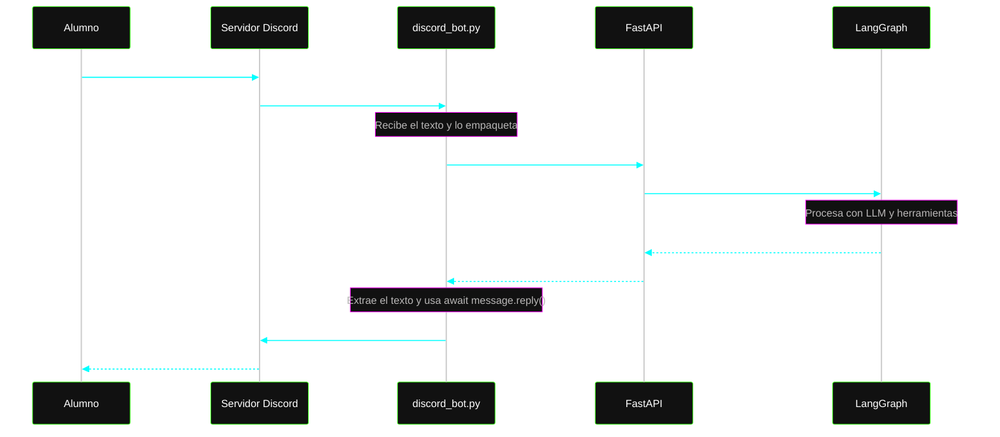

### Flujo
1. **Alumno** escribe un mensaje en Discord.  
2. **Servidor Discord** lo reenvía al `discord_bot.py` mediante WebSocket.  
3. **discord_bot.py** empaqueta el mensaje y hace una petición HTTP POST a **FastAPI**.  
4. **FastAPI** recibe la petición e invoca internamente a **LangGraph** (en memoria RAM).  
5. **LangGraph** procesa el mensaje usando el LLM y las herramientas, y devuelve el texto final a **FastAPI**.  
6. **FastAPI** responde a `discord_bot.py` con un HTTP 200 y la respuesta en JSON.  
7. **discord_bot.py** extrae el texto y utiliza el comando `await message.reply()` para enviarlo de vuelta al servidor de Discord.  
8. **Servidor Discord** publica la respuesta y el **Alumno** la ve en su pantalla.

> **Nota:** FastAPI nunca se comunica directamente con Discord. `discord_bot.py` actúa como puente o “embajador” ante Discord, lo que permite mantener una arquitectura limpia y desacoplada dentro del mismo entorno (por ejemplo, en AWS).

# estructura

