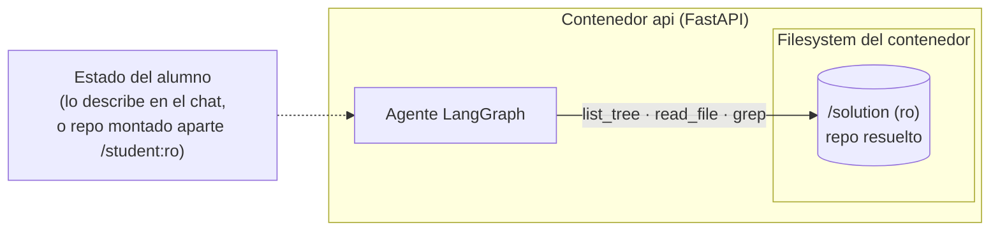
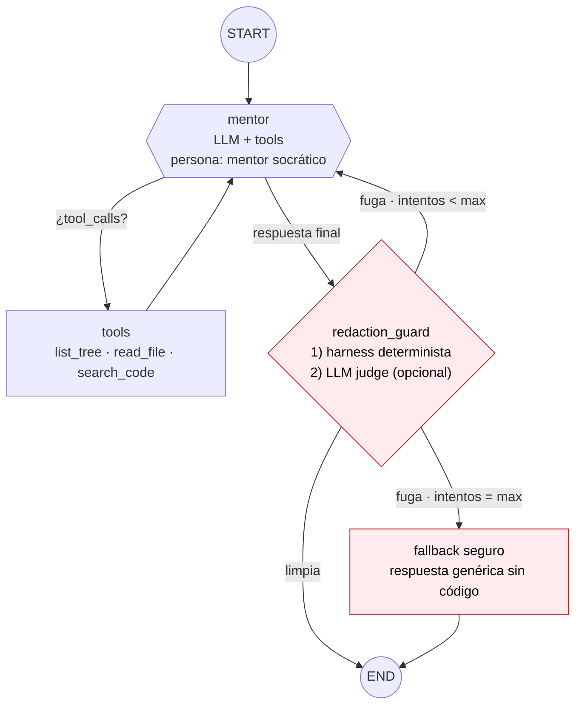

tengo una consulta respecto a este proyecto. como veraz es un agente de conversacion que principalmente resuleve dudadas de faq's de una empresa asi como informaciones relevantes como fechas, deadlineas, links etc. quiero crear una version 3.0 donde el agente se enfoque en resolver dudas sobre un proyecto de codigo real (un repo con carpetas anidadas, readme, codigo, scripts, etc) . el objetivo seria construir un asistente de desarollo de proyecto. en ese sentido el alumno le hace preuntas de alguna seccion donde este trabado y el bot le constesta, no dandole el codigo directamente (jams debe hacer eso) sino dandole unos pasos a aseguir para llegar a la solcuion y los mas importante como la solucion encaja en el desarollo del proyecto commo un todo. es iportante destacar que el pryecto que deberia tener acceso el bot debe estara solucionado, no asi el proyecto que tiene el alumno, en su lugar el alumno tendra todos para ahcer . eso no involucra que el proyecto este completamente vacio. esta parcialmente completado con todo que el alumno tiene que resolverlo. en ese sentido, que deberia cambiar en el proeycto a modo geenral (no entres en detalles inncesarios) sino a modo general. es decir, se tendria que vectorizar el repo? como? que otro camino mas corto y eficiente hay?

Buena consulta. Déjame primero echar un vistazo rápido a cómo está armado tu proyecto actual para darte una respuesta aterrizada a tu stack, no genérica.

  Read 1 file, listed 1 directory, ran 1 shell command

Ya veo — tienes un RAG con Chroma, pipeline de ingestión y un monorepo (bot/api). Déjame ver cómo está armada la ingestión y el bot para responderte con base en tu stack real.

  Ran 1 shell command

Déjame ver la lógica de ingestión y el agente para entenderl.

  Read 1 file, ran 2 shell commands
                                                                                                                                                     Ya tengo el panorama completo de tu stack. Te resumo qué esspondo directo a tu pregunta.
                                                                                                                                                   Lo que tienes hoy (v2.0): un RAG clásico — faqs.txt → chunkmbeddings (SentenceTransformer) → ChromaDB con reranker(CrossEncoder) → agente LangGraph con 3 tools (search_academy_faqs, get_class_link, get_sprint_deadline). Toda la infra (EC2/EBS/S3/Chroma) existe para servir ese índice.

La pregunta clave que haces —¿hay que vectorizar el repo?— blemente te sorprenda: para tu caso, seguramente no, o nocomo lo hiciste con las FAQs. Te explico por qué y cuáles son los caminos.

---
1. Por qué tu pipeline actual NO se traslada tal cual

Tu RAG está diseñado para prosa plana (FAQs). Un repo de có

- El chunking por 500 caracteres destroza el código. Parte un import de donde se usa, corta una clase. El significadodel código es estructural, no fluye como un párrafo. Chunkear código como texto = retrieval basura.
- Tus chunks son anónimos (chunk_0, chunk_1…). Pero tu obje "cómo encaja esto en el proyecto como un todo" — eso exigesaber de qué archivo, módulo y función viene cada pedazo. Esa metadata hoy no existe.

Además, la pregunta sobre código no suele ser difusa/semántica ("¿qué pasa si repruebo un sprint?"), sino precisa y navegable ("¿dónde se implementa
la autenticación?", "¿qué me falta en sinks.py?"). Para eso martillo para un tornillo.

---
2. Los tres caminos

Camino A — Vectorizar el repo (RAG, pero code-aware).
Sería: chunking por estructura (función/clase, idealmente vng de código (no el de FAQs), y metadata rica por chunk(path, symbol, tipo). Solo vale la pena si el repo es enorme (no cabe en contexto). Es el camino más caro: rehaces ingestión, eliges otro modelo,
mantienes re-ingesta cada vez que cambie el proyecto soluci

Camino B — No vectorizar: darle al agente tools de navegaci
Le das al bot el repo-solución como archivos (clonado/montado) y tools tipo list_files, read_file, search_code (grep). El agente navega y lee bajo
demanda — exactamente como trabaja un agente de coding (comn los modelos actuales de contexto largo, un proyecto decurso (decenas a un par de cientos de archivos) se maneja así perfectamente. Más preciso, más barato de mantener, y elimina de un plumazo todo el
problema del chunking, embeddings y la infra de Chroma/EBS/

Camino C — Híbrido ligero. (lo que yo recomendaría)
Un mapa del repo siempre en contexto (árbol de carpetas + README + firmas/docstrings de funciones) para que el agente se oriente, + tools de lectura
de archivos bajo demanda. Opcionalmente, búsqueda semánticade está X". Lo mejor de ambos sin el peso de un pipeline de vectorización completo.

---
3. Recomendación

Para un proyecto-solución acotado (que es tu caso: un proyeools de archivos, no re-vectorizar. El RAG vectorial brillacon corpus gigante y matching difuso de lenguaje natural; el Q&A de código se sirve mejor con navegación estructurada + lectura del archivo real.
Reservas la vectorización solo si el repo crece tanto que n

---
4. Qué cambia concretamente en tu repo

┌─────────────────────────────┬─────────────────────────────────────────────────────────────────────────────────────────────────────────────────┐
│         Componente          │                            asa                                                     │
├─────────────────────────────┼─────────────────────────────────────────────────────────────────────────────────────────────────────────────────┤
│ Agente LangGraph (graph.py) │ Se queda igual (el patrón a                                                        │
├─────────────────────────────┼─────────────────────────────────────────────────────────────────────────────────────────────────────────────────┤
│ Tools (tools.py)            │ Cambio grande: search_acadeols de código (read_file, list_tree, grep).             │
│                             │ get_sprint_deadline/get_class_link puedes conservarlas (deadlines siguen siendo útiles).                        │
├─────────────────────────────┼────────────────────────────────────────────────────────────────────────────────────┤
│ Pipeline de ingestión +     │ Solo lo necesitas si vas por Camino A. En B/C lo puedes jubilar — el "knowledge base" pasa a ser el             │
│ Chroma + infra EBS/S3       │ repo-solución como archivos                                                        │
├─────────────────────────────┼─────────────────────────────────────────────────────────────────────────────────────────────────────────────────┤
│ System prompt               │ El cambio conceptual más im                                                        │
└─────────────────────────────┴─────────────────────────────────────────────────────────────────────────────────────────────────────────────────┘

# Arquitectura — AnyBuddy v3.0 (Mentor de Código · Camino B)

Asistente que responde dudas sobre un **proyecto de código real**. El bot tiene acceso
al **repo-solución** (completo, resuelto); el alumno tiene una versión **parcial**. El bot
nunca entrega código literal: da pasos, pistas y explica **cómo la pieza encaja en el todo**.

Camino elegido: **B — navegación por archivos, sin vectorización**. Se jubila Chroma / la
ingesta / el índice en EBS-S3. El "knowledge base" pasa a ser el repo-solución montado.

---

## 1. Qué significa "montar" el repo

**Montar** = hacer que los archivos del repo-solución existan dentro del contenedor `api`,
en una ruta fija y **solo-lectura** (p. ej. `/solution`), para que las tools hagan I/O real
sobre esos archivos. No es una base de datos ni un índice: es el árbol de archivos tal cual.

Tres formas de lograrlo (de más simple a más flexible):

| Forma | Cómo | Cuándo |
|---|---|---|
| **Bake en la imagen** | `COPY ./solution /solution` en el Dockerfile de la API | Solución estable, no cambia seguido. Lo más simple. |
| **Bind mount / volumen** | En `docker-compose.yml`: `volumes: - ./solution:/solution:ro` | La solución vive en el host/EBS y se actualiza sin rebuild. |
| **Clonar al arrancar** | Un `git clone` de un repo privado a `/solution` al iniciar | La solución vive en Git y quieres versionarla aparte. |

El `:ro` (read-only) es la primera capa del harness: el agente **no puede modificar** la
solución aunque una tool tuviera un bug.



### Cómo se "trabaja bajo la montadura"
Las tools reciben rutas **relativas** a la raíz montada y hacen `os.path.join(SOLUTION_ROOT, path)`.
No hay magia: es lectura de archivos normal. Las 3 tools mínimas:

- `list_tree(subdir=".")` → devuelve el árbol de carpetas/archivos (orientación).
- `read_file(path)` → devuelve el contenido de un archivo (para que el agente *entienda* la solución).
- `search_code(query)` → grep/ripgrep sobre `/solution` (para localizar "¿dónde está X?").

**Punto clave de seguridad (harness de rutas):** cada tool debe resolver la ruta real
(`os.path.realpath`) y verificar que **sigue cayendo dentro de `/solution`**. Si no, rechaza.
Esto evita que un `read_file("../../../etc/passwd")` se escape del sandbox.

### Punto de diseño: el bot necesita DOS estados
- **Solución** (`/solution`, ro): la fuente de verdad, para saber la respuesta correcta.
- **Estado del alumno**: para saber *qué le falta* y ubicar la pista. En B, lo más simple es
  que el alumno lo describa en el chat. Si quieres precisión, montas también su repo en
  `/student:ro` y agregas un `read_student_file` / `diff_with_solution`.

---

## 2. Dónde vive el riesgo de fuga (y por qué es más chico de lo que parece)

En LangGraph, **la salida de las tools es interna**: `read_file` devuelve el código al *modelo*,
no al alumno. Al alumno solo le llega el **mensaje final del agente**. Por lo tanto:

> El único punto donde el código puede filtrarse es el **mensaje final**. Ahí va el harness.

Todo el contenido del `/solution` que las tools leen circula por dentro del grafo sin problema;
lo que hay que blindar es la frontera **grafo → alumno**.

---

## 3. Esquema de nodos propuesto (con harness anti-fuga)

Dos capas: **preventiva** (que no genere código) y **detectiva** (que si lo genera, no salga).



### Los nodos

**`mentor`** — tu `call_model` actual, pero con:
- *System prompt de mentor socrático* (la capa preventiva más importante): "Nunca escribas
  código de la solución, ni snippets, ni líneas literales. Da pasos numerados, nombra el
  archivo/función donde toca trabajar, explica cómo encaja en el flujo completo. Si te piden
  el código, reencáuzalo hacia el razonamiento."
- Las 3 tools de navegación vinculadas.

**`tools`** — `ToolNode` con `list_tree`, `read_file`, `search_code`. Igual patrón que hoy.

**`redaction_guard`** — el nodo nuevo. Corre **solo sobre el mensaje final**, en dos etapas:

1. **Harness determinista (siempre, barato):** compara el borrador contra los archivos de
   `/solution`. Si detecta una coincidencia de **N líneas/tokens contiguos** con cualquier
   archivo real, marca fuga. Es un chequeo sin LLM: rápido, explicable, sin falsos negativos
   por paráfrasis obvia. También puedes marcar cualquier bloque ``` ``` ``` con > K líneas.
2. **LLM judge (opcional, condicional):** un modelo chico clasifica "¿esto revela la
   implementación?". Solo lo disparas **si** el borrador trae bloques de código o alto solapamiento
   — así no pagas un LLM extra en cada turno. Atrapa fugas parafraseadas que el harness 1 no ve.

### El enrutamiento (dos condicionales)

- Desde `mentor` (igual a tu `should_continue` de hoy): ¿hay `tool_calls`? → `tools`, si no → `redaction_guard`.
- Desde `redaction_guard`:
  - **limpia** → `END`.
  - **fuga y `revision_count < max`** → vuelve a `mentor` con una instrucción de corrección
    ("tu respuesta incluía código literal; reescríbela solo con pasos") e incrementa el contador.
  - **fuga y `revision_count == max`** → `fallback` (respuesta segura genérica) → `END`.
    El contador evita bucles infinitos.

### Estado (qué se agrega a `AnyBuddyState`)
- `revision_count: int` — reintentos de reescritura.
- (opcional) `leak_report` — qué archivo/líneas coincidieron, para el prompt de corrección.

---

## 4. Por qué este esquema es eficiente

- **El guard corre una sola vez, al final** — no en cada vuelta del loop de tools.
- **La etapa determinista es casi gratis** y ataca el 90% de las fugas (copiar-pegar literal).
- **El LLM judge es condicional** (gated): solo se invoca cuando hay señal de código, no siempre.
- **Tope de reintentos** → coste acotado y sin loops.
- **Reutilizas casi todo `graph.py`**: mismo patrón agent↔tools; solo agregas un nodo y una arista.

---

## 5. Qué se jubila y qué se conserva (vs v2.0)

| Componente v2.0 | En v3.0 (Camino B) |
|---|---|
| Pipeline de ingesta + `ingest.py` + chunking | **Se jubila.** |
| ChromaDB + reranker + índice en EBS/S3 | **Se jubila.** |
| `search_academy_faqs` (tool) | **Se reemplaza** por `read_file` / `list_tree` / `search_code`. |
| `graph.py` (patrón agent↔tools) | **Se conserva** + nodo `redaction_guard`. |
| `get_sprint_deadline` / `get_class_link` | **Se conservan** (deadlines siguen siendo útiles). |
| Bot de Discord + API FastAPI + infra EC2 | **Se conservan.** El montaje del repo reemplaza al montaje del índice. |
| System prompt | **Cambia por completo:** de "asistente de FAQs" a "mentor socrático". |

---

## 6. Diseño de las tools (concreto)

Todas operan **solo sobre `/solution`** (read-only). El código del alumno llega por el chat,
no por una tool. Con **3 tools basta**; una 4ª es opcional (harness pedagógico).

Recuerda que en tu stack el **docstring de cada `@tool` ES la interfaz**: el LLM lo lee para
decidir cuándo llamarla. El docstring es prompt-engineering, no comentario.

### Tool 1 — `list_tree` (el mapa)
```
list_tree(subdir=".", max_depth=3) -> str
```
- **Devuelve:** el árbol de carpetas/archivos (excluyendo ruido: `.git`, `__pycache__`, etc.).
- **Para qué:** orientación. Que el agente sepa *dónde* viven las cosas antes de leer.
- **Guardrail:** la ruta resuelta debe caer dentro de `/solution`.

### Tool 2 — `read_file` (el caballo de batalla)
```
read_file(path, start_line=None, end_line=None) -> str
```
- **Devuelve:** el contenido del archivo **con números de línea**; opcionalmente un rango.
- **Para qué:** entender la implementación correcta y su contexto.
- **Guardrails:** `realpath` dentro de `/solution`; **tope de tamaño** — si el archivo es enorme
  y no se pide rango, devuelve un recorte + aviso (no volcar 2000 líneas al contexto).
- **Detalle pedagógico clave:** al devolver números de línea, el mentor puede decirle al alumno
  *"revisa la línea 42 de `sinks.py`"* — **señala la ubicación sin pegar el código.**

### Tool 3 — `search_code` (el localizador)
```
search_code(query, file_glob=None) -> str
```
- **Devuelve:** líneas que coinciden, en formato `path:línea: contenido` (grep/ripgrep).
- **Para qué:** "¿dónde se define/usa X?", encontrar la región del TODO, rastrear el flujo.
- **Guardrails:** dentro de `/solution`; **tope de resultados** (p. ej. 30).

### Tool 4 (opcional) — `get_file_outline` (esqueleto)
```
get_file_outline(path) -> str
```
- **Devuelve:** solo **firmas + docstrings** de funciones/clases (sin los cuerpos).
- **Doble ganancia:** (a) orientación barata sin cargar la implementación completa; (b) es un
  **harness pedagógico** — el agente razona sobre la estructura sin tener el código literal
  delante, así que hay menos que filtrar. Recomendable si el proyecto es grande.

### Cómo se encadenan en tu ejemplo real
Alumno: *"Tengo este error al implementar el TODO de `publish_outputs`"* + pega su código + traceback.

1. `search_code("publish_outputs")` → lo ubica en `/solution/.../sinks.py`.
2. `read_file("sinks.py", 1, 60)` o `get_file_outline("sinks.py")` → el agente ve cómo *debería*
   quedar y qué firma/contrato tiene.
3. `search_code("publish_outputs")` (o `list_tree`) → ve **quién la llama** (`ingest.py`) para
   explicar cómo encaja en el flujo de ingesta completo.
4. El mentor compone: pasos numerados + "esto va en `sinks.py`, y encaja aquí en el pipeline
   porque `ingest.py` la llama al final" — **nunca el código**.
5. `redaction_guard` valida el mensaje final antes de enviarlo.

### Por qué NO hacen falta más tools
- **Escribir/modificar:** no — el bot guía, no edita (y `/solution` es `ro`).
- **Leer el repo del alumno:** no en el flujo básico — el alumno pega su código.
- **Ejecutar el código:** no — el mentor razona sobre el error que el alumno ya trae.

Si más adelante quieres precisión sobre el estado del alumno (en vez de que lo pegue), agregas
`/student:ro` y un par de tools espejo (`read_student_file`, `diff_with_solution`). Pero eso es
una extensión, no el núcleo.

---

## 7. Resumen de las 3 ideas clave

1. **Montar = archivos ro en `/solution`.** Las tools hacen lectura real con guard de rutas.
   No hay índice ni vectores; el repo-solución *es* el conocimiento.
2. **La fuga solo puede ocurrir en el mensaje final** (las tools son internas al grafo). Ahí
   se coloca el `redaction_guard`.
3. **Prevención (system prompt) + detección (harness determinista + LLM judge condicional) +
   tope de reintentos.** Simple, barato, y sin bucles.
